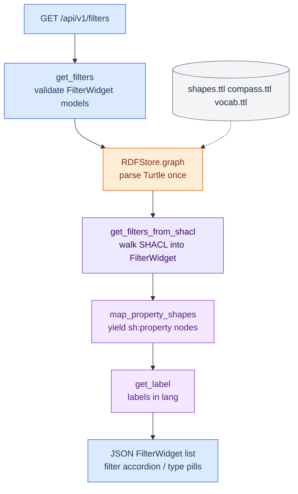
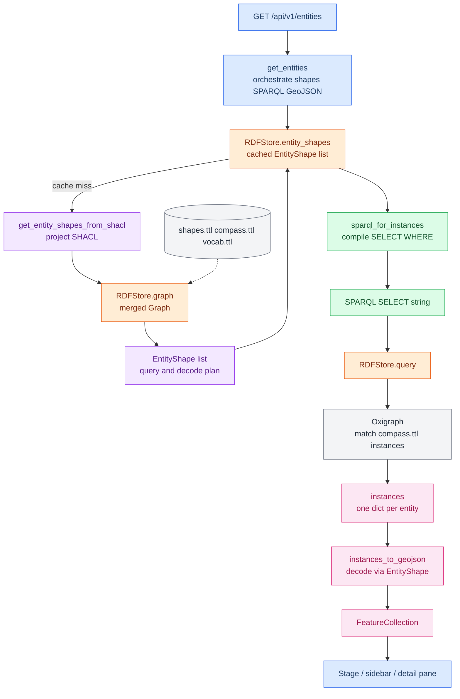

# Design

## Request flow

Node colours in the diagrams:

| Colour | Module |
| --- | --- |
| Blue | API, `routers/filters.py` or `routers/entities.py`, Frontend |
| Orange | `rdf.py` |
| Purple | `shacl_to_filters.py` |
| Violet | `shacl_to_entities.py` |
| Green | `sparql_builder.py` |
| Pink | `sparql_to_geojson_translator.py` |
| Grey | Ontology Turtle / Oxigraph |

### Filter panel (on load)

### Entities (on load and on every filter or language change)

The widget calls `getEntities` from `loadData`. The backend compiles SPARQL
from the entity shapes, runs it, and returns GeoJSON.

## Filters and entities

- **Entities** are the pins: forums, networks, partner organisations and the
  host organisation. Clicking one opens the detail pane (name, type, tag chips).
- **Filters** narrow the set: the filter sections (work areas, topics,
  programmes, species, countries / regions) and the entity-type pills. The
  result count is the number of matching entities.

The backend builds both from separate SHACL projections:

| Model | Endpoint | Module | Feeds |
| --- | --- | --- | --- |
| `FilterWidget` | `GET /api/v1/filters` | `shacl_to_filters` | Filter panel |
| `EntityShape` | `GET /api/v1/entities` | `shacl_to_entities` | SPARQL query and GeoJSON: pins, sidebar, detail pane |
