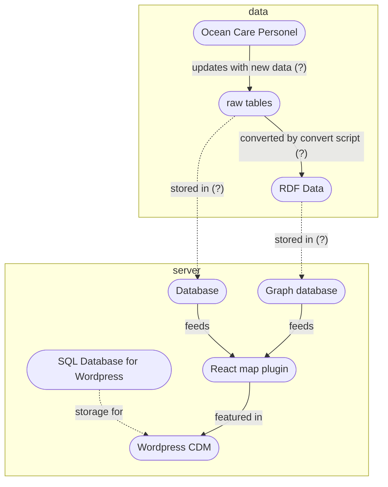

# Infrastructure Diagram

## Ocean Care

Questions:

- do we need a graph database? or can we store the RDF as JSON or other format in a DB.
- should database be postgres or RustFS (bucket storage) ? --> Depends on what we need to store.
- do we store tables and RDF or just RDF ?
- convert script: what language?

Flows:

- what is the schedule for data updates? once per month or more often? 

