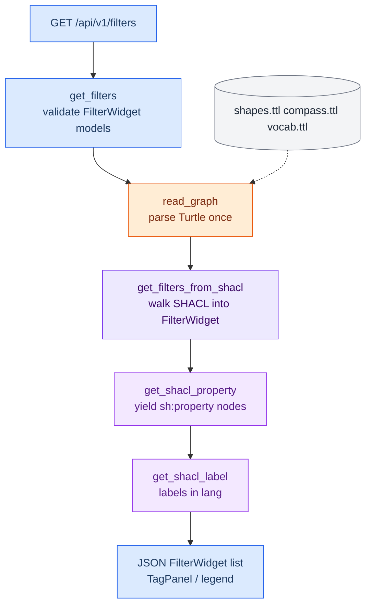
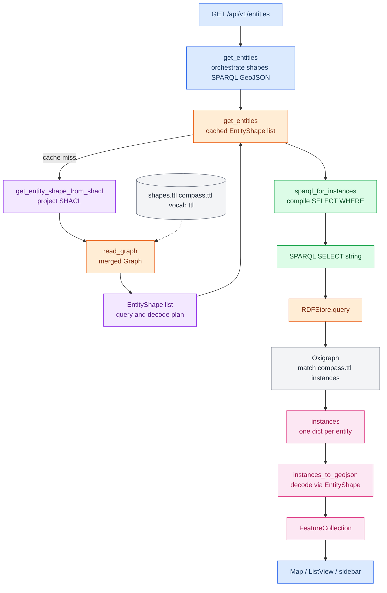

# Backend

## Running

```bash
uv run uvicorn app.main:app --reload --port 8000
```

## Tests

```bash
uv run pytest tests/ -v
```

---

## Design Explanations

### From SHACL & SPARQL to Filters & Entities


| Color | Script |
| --- | --- |
| Blue | API, `routers/filters.py` or `routers/entities.py`, Frontend |
| Orange | `rdf.py` |
| Purple | `shacl_to_filters.py` |
| Violet | `shacl_to_entities.py` |
| Green | `sparql_builder.py` |
| Pink | `sparql_to_geojson_translator.py` |
| Gray | Ontology Turtle / Oxigraph |

#### Boot — create filter panel



#### Map load / filter change

When language or filters change (`loadData` → `getEntities`). Builds SPARQL, fills instances, returns GeoJSON.



#### Filters & Entities

For the map user, the relationship is simple: **filters ask; entities answer.**

**Entities** are the **things on the map** (and in the list): a Project, Network,
Partner, or Forum as a pin, or a Country/Area as a shaded region. Click one and
the sidebar or list row shows name, type, and colored tag chips.

**Filters** are the **controls that narrow that set**: the filter panel (topics,
species, regions, …) plus the map legend type toggles. Choosing chips changes
which entities stay visible; the result-count badge is “how many entities match.”

| | Filter (UI) | Entity (UI) |
| --- | --- | --- |
| Looks like | Sections of clickable chips / legend dots | Pins, regions, list rows, detail sidebar |
| Role | “Show me only …” | “Here is one matching thing” |
| Example | Chip **Pollution → Plastics** | Project pin whose properties include that tag |

In the backend, those two faces are separate SHACL projections:

- `FilterWidget` → `GET /api/v1/filters` (`shacl_to_filters`) → Filter panel
- `EntityShape` → `GET /api/v1/entities` (`shacl_to_entities`) → SPARQL + GeoJSON → pins/list/sidebar
